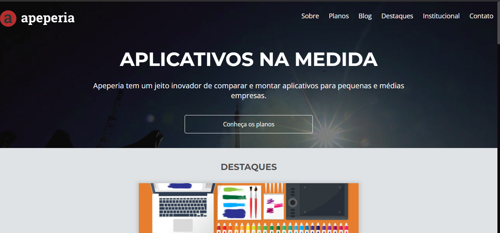

## 💻 Projeto Apeperia
Projeto Web Responsivo de uma Apeperia.

## 🚀 Tecnologias

-HTML
-CSS
-Git e Github

## 🏷️ Layout
Você pode visualizar o layout do projeto através 
[desse link](https://www.figma.com/file/zu9ZIEISwnhFavA28iRlCX/Apeperia-Mobile-First?type=design&node-id=0%3A1&t=sRaWi2okxVuX5ddI-1).
ps: É necessário ter uma conta no [figma](https://www.figma.com)

